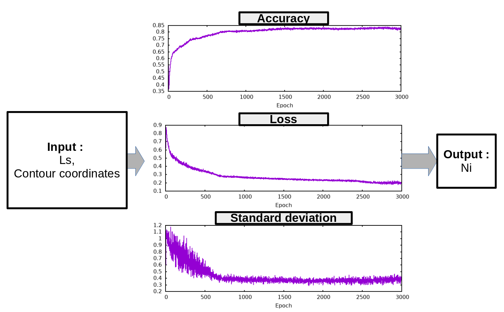
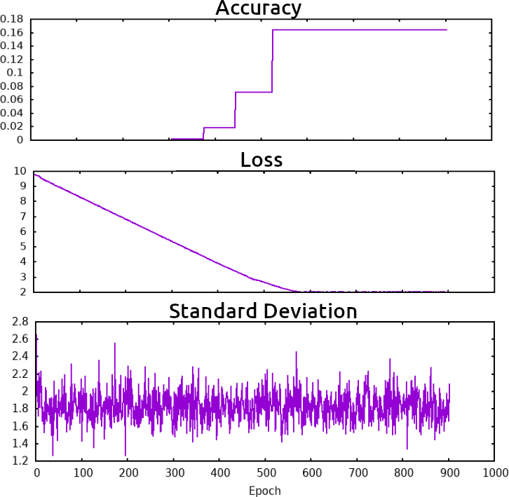

Neural Network N°1
==================
The first neural network estimates the number of inserted point inside a given geometry. It takes as input the countour coordinates and the desired mesh size ls. 

------------------
Database Generation
------------------
Before training the neural network, the database is created by extracting the number of vertices inserted by Gmsh inside a polygon contour. The database is composed of input files storing the contour cordinates and ls has a single vector. A label file references every element of the database with the path of the input file and the expected output given by Gmsh. 

-----------------
Network architecture
-----------------
The architecture of the network is simple : 3 layers of perceptrons with batch normalisation using the ReLU activation function for the first two layers. Each layer is composed of 4 * Nc nodes. 

-----------------
Training
-----------------
To train the Neural Network, the PyTorch framework is used. The data is loaded using a Dataset and DataLoader class. At every epoch, two main loops are performed. A train loop updates the weights of the Network for each batch of data. Then, a test loop evaluates the accuracy, the average loss and the standard deviation on predictions. 

-----------------
Results 
-----------------
During a training, the accuracy, average loss and the standard deviation are ploted. In the Fig(), the network is trained for 4 contour vertices. In the Fig(), the network is trained for 10 contour vertices. 

.. _fig-res1:

The network converges well. The accuracy reaches 80% that after 500 epochs while the averge loss stops decreasing. Moreover, the standard deviation is inferior to 1. This means that the neural network is close to the solution even when it misses. 

.. _fig-res2:

However, when more contour point are present, the network is less accurate. This is due to the fact that on average more points are incerted in a polygon.

