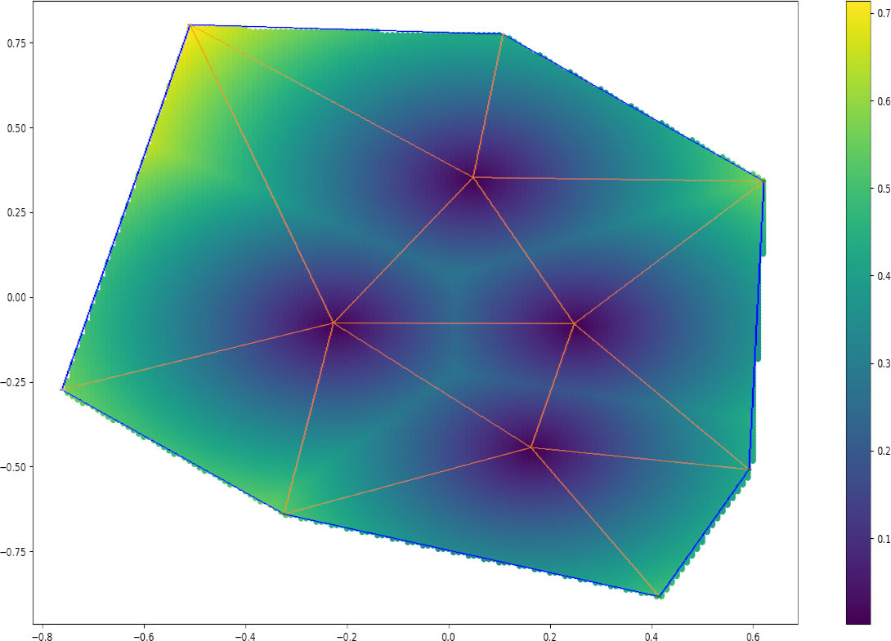
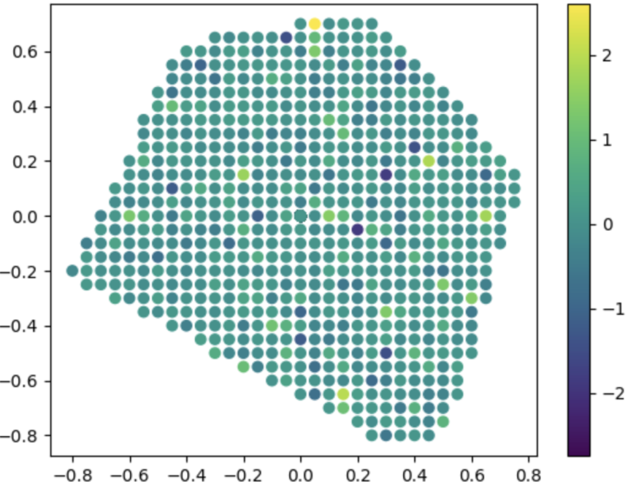
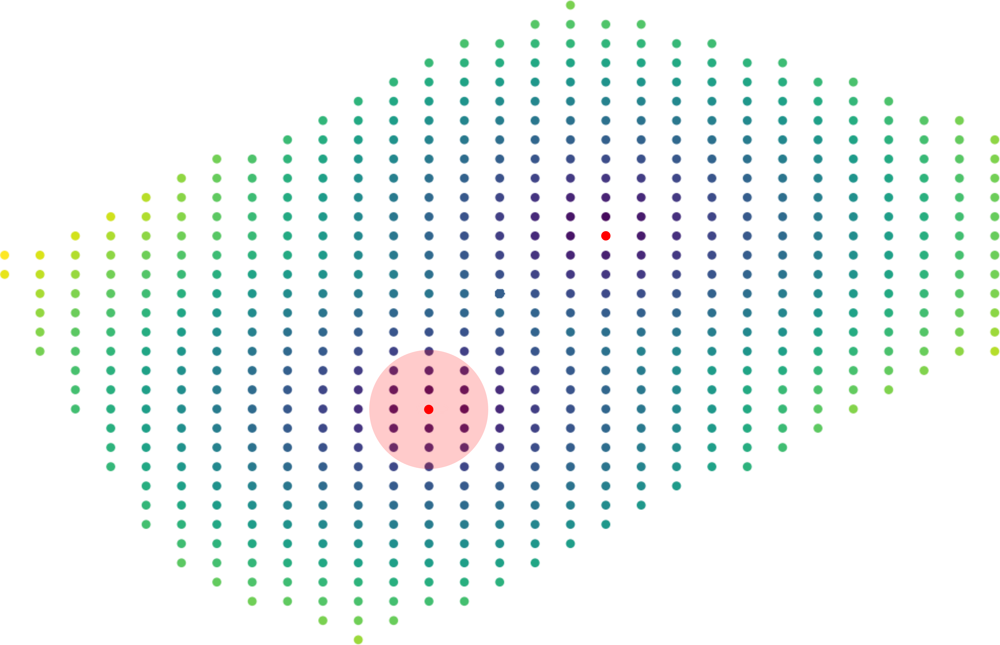
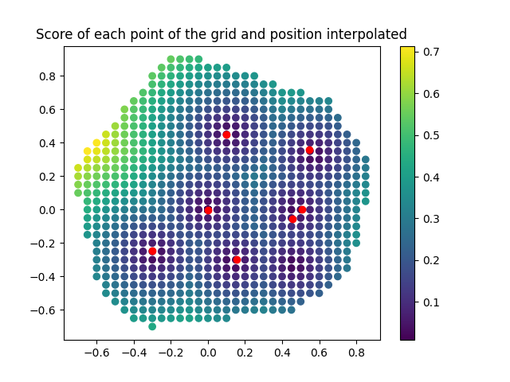
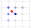
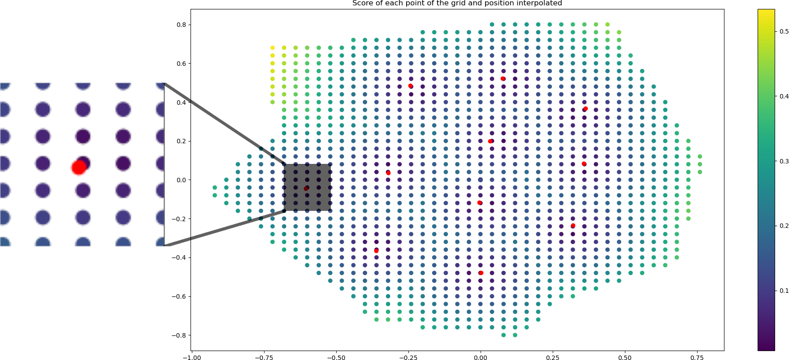

Neural Network N°2
==================

----------------------------
 Goal of the neural network
----------------------------

This Neural Network (NN2) aims at guessing the coordinates of the inner nodes. 
The algorithm takes as input the number of inner nodes approximated by the first neural network,
and the coordinates of the nodes of a cartesian grid that are inside the polygon.

---------------------
 Database generation
---------------------

We need to generate the same polygons as the first neural network, get the number of inner nodes 
generated by gmsh, but also their coordinates. 

^^^^^^^^^^^^^^^^^
Grid Generation
^^^^^^^^^^^^^^^^^

This second neural network works with a cartesian grid of fixed scale.
The size of the elements of the grid is arbitrary, 
but should logically be smaller than the size of the smallest edge.

.. code-block:: python

    Gscale_factor = 0.1
    Gscale = Gscale_factor * ls  # size of mesh grid

The grid should first contain the entire polygon, 
thus its side size should be greater than the maximum distance between two points 
on the horizontal and vertical axis.
However, the polygon is scaled and is always contained in the unit circle. 
It is then more conveignant and faster to keep the unit size 
instead of optimizing a few hundredths every iteration. 
A visualization of this grid is shown :numref:`fig-schemaNN_grid`.

.. _fig-schemaNN_grid:

  Example of grid for a polygon of 7 nodes  

The grid generation is made by the ``create_grid()`` function.

The entire grid is given to the network, whereas the article 
:cite:`papagiannopoulos_clausen_avellan_2021` splits the grid in multiple parts 
to give more data to the network. 
This could be done in a future version of the project.

^^^^^^^^^^^^^^^^^
Inner nodes
^^^^^^^^^^^^^^^^^

Once the grid is generated, we need to find the coordinates of the grid nodes 
that are inside the polygon. 
To do so, the function ``is_in_contour()`` uses the Even-odd rule.
The algorithm is taken from `this python code <https://en.wikipedia.org/wiki/Even%E2%80%93odd_rule#cite_note-3>`_ from :cite:`wikipedia_2021`.

^^^^^^^^^^^^^^^^^
Scores of nodes
^^^^^^^^^^^^^^^^^

Each grid node now has to be graded with a score defined as 
the distance to the closest mesh vertex. The function ``score_of_node()`` 
gives the score of a given node and ``calculate_score_array()`` 
the list of scores for each point of the grid inside the polygon.

:numref:`fig-scores_mesh_examples` shows an example of score map generated 
from the localization of the inner vertex places by gmsh (mesh in red). 
The darker the color, the closer we are to an inner vertex.

.. _fig-scores_mesh_examples:

  Example of scores distribution for polygons of 7 nodes. 
  We can see the 4 nodes placed by gmsh.  

NN2 will have to return this list of scores on its own once trained given 
the coordinates of the grid points inside the polygon and the number of inner nodes.

---------------------
 Neural Network
---------------------

The NN2 takes as input the contour coordinates, the coordinates of the
grid points inside the polygon and the target edge lenght ``ls``. 
It is trained by receiving a score list for every node of the grid 
and tries to guess the scores by itself after the training.

^^^^^^^^^^^^^^^^^^^^^
Network architecture
^^^^^^^^^^^^^^^^^^^^^

The authors of :cite:`papagiannopoulos_clausen_avellan_2021` give 
the hyperparameters of the neural network:

 "There are 3 layers with batch normalization and the ReLU activation function 
 for the first 2 layers. The first two layers contain 
 :math:`2 \cdot N_{C}+N_{G_{k}}` hidden nodes and the output layer contains 
 :math:`N_{G_{k}}` nodes."

Those hyperparameters are easily programmed with Pytorch as shown below:

.. code-block:: python

  class NN2(nn.Module):

      def __init__(self, n_features: int, Np : int):
          Ngk = int(n_features/Np)
          super(NN2, self).__init__()
          self.l1 = nn.Linear(n_features, 2 * n_features + Ngk)
          self.b1 = nn.BatchNorm1d(2 * n_features + Ngk)
          self.l2 = nn.Linear(2 * n_features + Ngk, 2 * n_features + Ngk)
          self.b2 = nn.BatchNorm1d(2 * n_features + Ngk)
          self.l3 = nn.Linear(2 * n_features + Ngk, 1)
          self.b3 = nn.BatchNorm1d(Ngk)
  
      def forward(self, x: torch.Tensor):
          x = self.l1(x.float())
          x = self.b1(x)
          x = func.relu(x)
          x = self.l2(x)
          x = self.b2(x)
          x = func.relu(x)
          x = self.l3(x)
          x = self.b3(x)
          return x

^^^^^^^^^^^
Training
^^^^^^^^^^^

The training algorithm is also given in the article 
as highlighted in :numref:`fig-algo_NN2`.

.. _fig-algo_NN2:

  Algorihtm of NN2. Source : :cite:`papagiannopoulos_clausen_avellan_2021`

The code below shows the implementation of this algorithm:

.. code-block:: python

  def train_loop(dataloader: DataLoader, model: NN2, loss_fn: nn.L1Loss, optimizer, device):
 
      size = len(dataloader.dataset)
      model.train()
      for batch, (x, y) in enumerate(dataloader):
          x, y = torch.tensor(x).to(device), torch.tensor(y).to(device)
          y_pred = model(x)
          loss = loss_fn(y_pred.squeeze(), y)

          optimizer.zero_grad()
          loss.backward()
          optimizer.step()

      return

^^^^^^^^^^^^^^^^^^
Results
^^^^^^^^^^^^^^^^^^

Once the second neural network is trained, it can be used with 
the parameters set in the previous section. 
The convergence results for a training with only 1 example are shown in
:numref:`fig-convergence_nn2`.

.. _fig-convergence_nn2:

  Average loss of NN2 for 500 epochs and 1 example, ``Nc=6``.

The average loss seems to decrease, but stays too high.  
The figure :numref:`fig-result_nn2_1` shows the plot of the scores returned 
by this trained NN2.

.. _fig-result_nn2_1:

  Graphical results obtained by NN2 for 500 epochs and 1 example, ``Nc=6``.

No area stands out as a place to host an inner vertex, and the presence of negative 
scores shows that this neural network is not fully or properly trained.

| With only one example, we should expect ..... #A CONTINUER
| There are multiple possible reasons explaining this poor result:
| - # A CONTINUER

------------------------
 Final node positioning
------------------------

Once the list of scores is guessed by the NN2, we have to guess 
the coordinates of the mesh vertices, and 
perform an interpolation to place the nodes more precisely.

^^^^^^^^^^^^^^^^^^
Find the minimums
^^^^^^^^^^^^^^^^^^

A solution to find the nodes is made by the following algorithm: 

* Find the current node with the minimum score and mark it
* Remove all the nodes within a given radius around the marked node
* Find the new minimum and repeat

If the radius is large enough, the new minimum should be in a 
different position, and the operation can be repeated as much as there 
are inner nodes. :numref:`fig-radius_scores` shows an example of hexagon 
where 2 inner verticies need to be placed. The red circle represents the 
arbitrary radius in which the grid points are ignored.

.. _fig-radius_scores:

  Example of radius around the minimum (red point) 
  allowing the other red point to become the second minimum

In our program, the function ``remove_points_grid()`` 
removes all the points of the grid within the arbitrary radius 
with a simple condition based on the circle equation:

.. code-block:: python

    if((grid[i][0]-x)**2 + (grid[i][1]-y)**2 < radius**2):
            to_remove.append(i)
    grid = np.delete(grid, to_remove, axis=0)
    scores = np.delete(scores, to_remove)
    return grid, scores

The choice of ``radius`` is important, because a big radius implies more points 
to remove, thus more computation time, but a too small radius can misplace the points as illustrated in :numref:`fig-erreur_point`.

.. _fig-erreur_point:

  Example of point badly placed due to a too small radius 
  (``radius = 0.01*ls`` and ``Gscale=0.05*ls``)

^^^^^^^^^^^^^^^^^^
Interpolation
^^^^^^^^^^^^^^^^^^

Once we have the position of an inner node of the mesh locked on the grid, 
we choose to interpolate the scores of the grid points around this inner node
to place it more accurately out of the grid constraint. 
An example of this interpolation is represented in :numref:`fig-interpolation`.

.. _fig-interpolation:

  Simple schema of how the final node (red) is interpolated 
  from the scores around the minimum (center)

This interpolation is made by the function ``place_inner_vertex()``.
The interpolation is simple to implement with barycentric coordinates, 
but one has to know the index of the 8 nodes surrounding the minimum score node. 
The hardest part is to find the index of the nodes directly above and below the 
center node. In order to find these, we need to go through each node of the grid 
and look for the two nodes with the same x-coordinate as the center node 
and a y-coordinate close enough (distance of a square of the grid) 
to the center node y-coordinate. Then, the 6 other nodes index are easy to 
find, by addind or subtracting 1 to the index of the two nodes.

.. code-block:: python

    for i in range(len(grid)):
        if grid[i][0] == coord_min[0]:
            if abs(grid[i][1]-coord_min[1]) <= 1.1*Gscale:
                local_domain_label.append(i-1)
                local_domain_label.append(i)
                local_domain_label.append(i+1)

This function returns results as pointed out in 
:numref:`fig-interpolation_final_zoom`:

.. _fig-interpolation_final_zoom:

  Result of the interpolation of 11 nodes for a polygon of 10 sides
