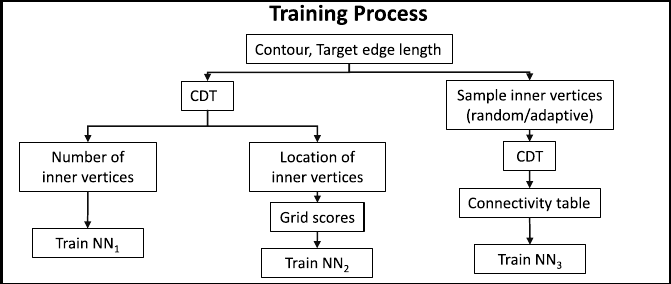
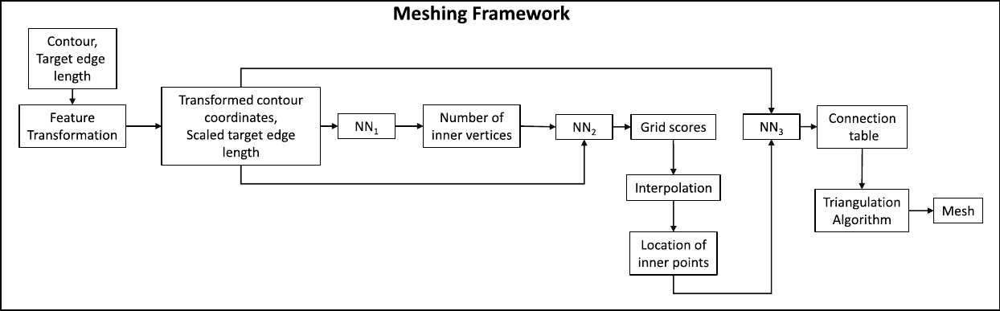

Overview of the algorithm
=========================

As said in the abstract, the aim of this project is to generate meshes of given polygonal contours with neural networks. To do so, the algorithm presented in :cite:`papagiannopoulos_clausen_avellan_2021` uses three neural networks called NN1, NN2 and NN3, whose aims are respectively to: predict the number of inner vertices, predict the locations of the inner vertices, and build a connectivity table containing probabilities of connection between each vertex of the mesh.

Training algorithm
------------------

Before they can be used, the three neural networks have to be trained. An overview of the training process is given in figure :numref:`training`. Assuming a database containing polygonal geometries have been generated, each polygon in the database is then meshed using a constrained Delaunay algorithm. The number of inner vertices and their locations are known, and this data can be used to train NN1 and NN2. A connection table can also be built from the generated mesh and is used to train NN3.

.. _training:

  Overview of the training process of the neural networks

Meshing framework
-----------------

Once the networks are trained, they can be used to generate meshed from new polygonal geometries. Figure :numref:`meshing_framework` shows the meshing algorithm used in :cite:`papagiannopoulos_clausen_avellan_2021`. First, the polygonal contour is transformed in order the be as close as a regular unit polygon (this part is described later). NN1 then takes as input the transformed polygonal contour, and outputs the number of inner vertices :math:`N_i`. NN2 takes as input the same transformed geometry and a cartesian grid and outputs a grid of scores corresponding to the predicted distance of each grid point to the location actual inner vertex. The inner vertices are then placed using this grid of scores, the previously predicted number of vertices and an interpolation scheme (described later). Finally, NN3 creates a connection table using the number of inner vertices and their locations, that is then used to create the actual mesh.

.. _meshing_framework:

  Overview of the meshing algorithm

