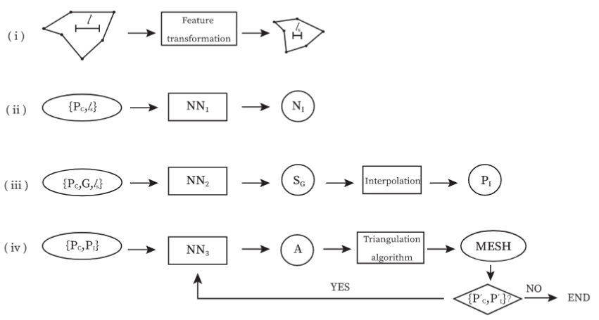

Overview of the algorithm
=========================

| The goal of this project is to generate meshes of a given polygonal contour with neural networks.
| This code is composed of 3 distinct neural networks, called *NN1*, *NN2* and *NN3*.

| NN1 guesses the number of inner nodes, NN2 guesses their position, and NN3 guesses the triangulation.
| This method is entirely based on the article "How to teach neural networks to mesh: Application on 2-D simplicial contours"

