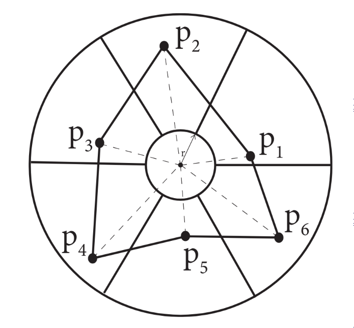
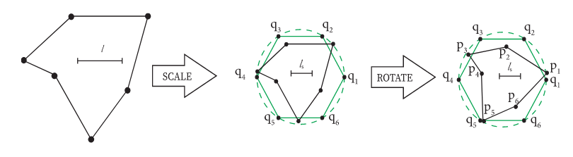

Database generation
===================

------------------
Database overview
------------------
To train the three neural networks, a database is needed. It is composed of thousands of meshed polygon contours. It is important to note that for a given number of points in contour, there is a corresponding database. For example, the database labeled 8 is used to train the models used to generate polygons of 8 contour vertices. To create an element of the database labeled Nc, a random polygonal contour is first generated. It is then scaled and rotated according to a regular polygon. Next, the scaled contour is meshed, using the consumer meshing software Gmsh. The mesh allows to extract the information needed for NN1, NN2 and NN3. 

------------------
Generation of a random contour 
------------------
To generate a random contour of Nc vertices, the method implemented is the same as the one described in the paper. A ring is created by making two concentric circles. This ring is then divided in Nc sectors. Then, 1 point is randomly chosed in each sector :numref:`fig-contour_gen`. 

.. _fig-contour_gen:

  
  Example of creation of contour with 6 vertices. 
------------------
Scaling 
------------------
To ensure a good training, each contour of the database is scaled and rotated according to a regular polygon inscribed in a unit circle :numref:`_fig-rotate_scale`. To achive this transformation, we used the procruste function in the scipy library. The function scale and rotates the generated polygon to minimize the distance between the points of the regular polygon and the points of the generated polygon.

.. _fig-rotate_scale:

  Rotation and scaling of a polygon
------------------
Meshing 
------------------
The transformed generated polygons can now be meshed. To do so we used Gmsh, an Opensource meshing software, via the Python API. The python function mesh_polygon initialize the api, creates a model containing the contour vertices and edges. Next, the model can be meshed :numref:`fig-meshed_polygon`. It is choosed to not insert point on the contour edges, points may only be inserted inside the polygon. Finaly, the number of inserted vertices is extracted to train NN1. The cordinates of those vertices are extracted to train NN2. And the connectivity between those is extracted to train NN3. 

.. _fig-meshed_polygon:

  Rotation and scaling of a polygon

------------------
Automation 
------------------
Currently, only NN1 and NN2 are implemented. Thus only two of the three databases are generated. 
Nevertheless, to facilitate the use of the neural networks, a file structure has been established. At the root of the database, a label file lists all elements. On every line, there is the path to the file containing the input of the NN and the expected output. This structure is described Fig(). 

------------------
Missing feature
------------------
In the original article, the authors vary the size of the inner elements. This would allow the NN to target a specific mesh size. We have not been able to reproduce this feature. The methods we tried to implement the feature where not satisfactory, introducing a bias in the database. Hence we decided not to implement the feature. 